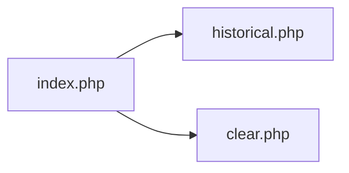
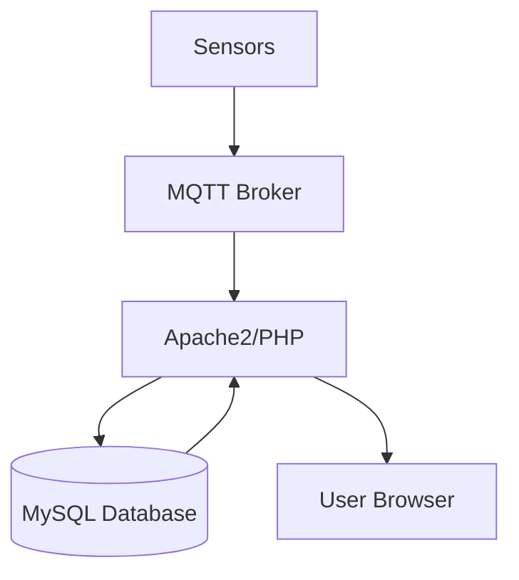
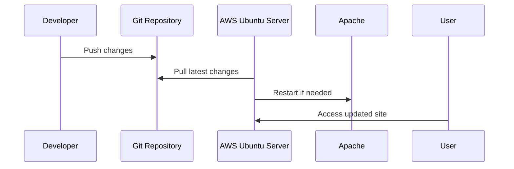

# Wheathampstead AstroPhotography Conditions

Website that publicly shows observatory sensor data. The site displays live and historical sensor readings with a modern interface.

## Features

- Live data via MQTT
- Historical data stored in a local MySQL table `obs_weather`
- Highcharts for interactive graphs
- Tabulator for data tables
- Tailwind CSS default styling with light and dark modes
- Index page lists all live data sources with links to historical views, shows a live updating graph, and displays nightly observable hours from the past 30 days
- Historical pages default to the last week of readings and include date range controls to browse any period
- Clear page shows safe observing hours aggregated by month for a selected year

## Sensor Data Tables

- `obs_weather` stores weather readings, including SQM values in the `light` column.
- `obs_light` stores readings from a separate light sensor with a `light` column.

### Retrieve both sensors

Use SQL joins or unions to combine the two tables without altering their schemas:

```sql
SELECT w.dateTime,
       w.light AS sqm,
       l.light AS light
FROM obs_weather AS w
JOIN obs_light   AS l
      ON w.dateTime = l.dateTime
ORDER BY w.dateTime DESC;
```

```sql
SELECT dateTime,
       'SQM'   AS sensor,
       light   AS reading
FROM obs_weather

UNION ALL

SELECT dateTime,
       'Light',
       light
FROM obs_light
ORDER BY dateTime DESC;
```

## Configuration

MQTT host and topic names are defined in `mqtt_config.json`. Update this file to match your local MQTT broker settings.
Each topic can optionally include a `green` threshold and a `condition` of `above` or `below` to highlight the card border when the incoming value meets the rule. Topics may also specify a `unit` string to label displayed values. The MQTT WebSocket port is 8083.

Database credentials are provided to Apache via environment variables:

- `DB_HOST`
- `DB_NAME`
- `DB_USER`
- `DB_PASS`

Set these variables in your Apache site configuration using `SetEnv` directives, for example:

```
SetEnv DB_HOST "localhost"
SetEnv DB_NAME "pubobs"
SetEnv DB_USER "pubobs_user"
SetEnv DB_PASS "secret"
```

## Site Pages



## Architecture



The web server subscribes to MQTT topics for real-time data and reads historical data from MySQL. Users access the site through their browsers.

## Updating the Website

1. SSH into the AWS Ubuntu server hosting the site.
2. Navigate to the project directory and pull the latest code:
   ```bash
   git pull origin main
   ```
3. Ensure Apache's environment variables contain valid database credentials.
4. Restart Apache if configuration or dependencies changed:
   ```bash
   sudo systemctl restart apache2
   ```



## Contributing

Add new design decisions to `AGENTS.md` and ensure documentation stays current.
