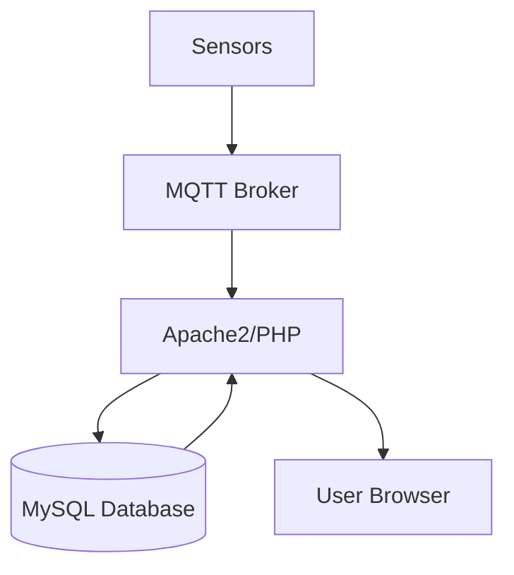
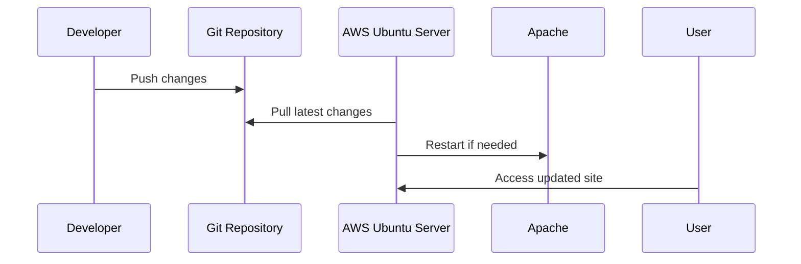

# PubObs

Website that publicly shows observatory sensor data. The site displays live and historical sensor readings with a modern interface.

## Features

- Live data via MQTT
- Historical data stored in a local MySQL database
- Highcharts for interactive graphs
- Tabulator for data tables
- Tailwind CSS default styling with light and dark modes
- Index page lists all live data sources with links to historical views and shows a live updating graph

## Architecture



The web server subscribes to MQTT topics for real-time data and reads historical data from MySQL. Users access the site through their browsers.

## Updating the Website

1. SSH into the AWS Ubuntu server hosting the site.
2. Navigate to the project directory and pull the latest code:
   ```bash
   git pull origin main
   ```
3. Ensure Apache's environment variables contain valid database credentials.
4. Restart Apache if configuration or dependencies changed:
   ```bash
   sudo systemctl restart apache2
   ```



## Contributing

Add new design decisions to `AGENTS.md` and ensure documentation stays current.
