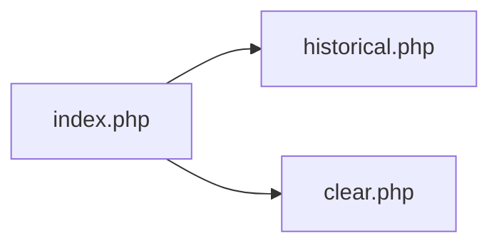
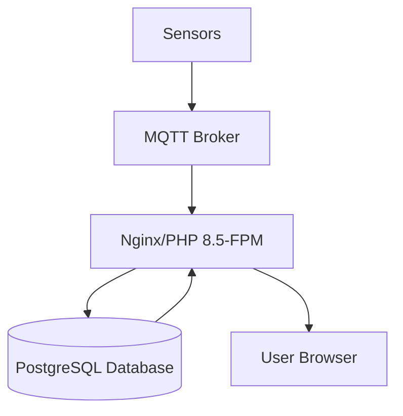
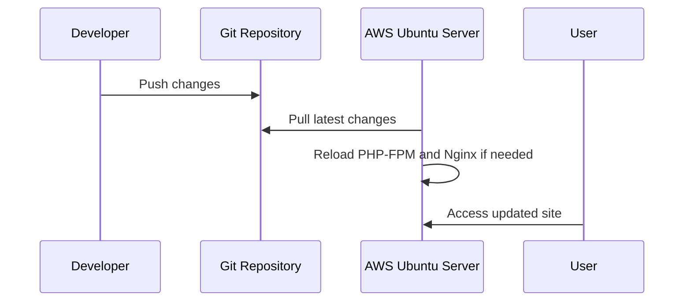

# Wheathampstead AstroPhotography Conditions

Website that publicly shows observatory sensor data. The site displays live and historical sensor readings through a professional, space-age telemetry interface designed around the observatory's own instruments.

## Features

- Live data via MQTT
- Historical data stored in a local PostgreSQL table `obs_weather`
- Native SVG sparklines for live sensor cards and Highcharts for interactive analytical and historical graphs
- Tabulator for data tables
- Tailwind CSS default styling with light and dark modes
- Index page lists all live data sources with links to historical views, shows a live sky image sourced via MQTT, and displays nightly observable hours from the past 30 days
- Historical pages load all available readings by default, fetching data via a JSON endpoint and using Highcharts controls to browse any range

- Historical pages accept optional `start` and `end` query parameters (`YYYY-MM-DD`) to limit the data returned
- Clear page shows safe observing hours aggregated by month for a selected year
- Shared observatory-console design across the dashboard, archive, history, and wall-display pages
- Lightweight CSS/SVG orbital visuals with no large decorative image downloads
- Celestial-navigation linework carried through the site background, heroes, telemetry cards, and analysis surfaces
- Extended desktop dashboard with a compact status strip, spacious 3×3 telemetry matrix, and side-by-side camera and analysis stack
- Prominent observing-safety state with sensor-specific language for binary safety and rain conditions
- Fail-safe freshness tracking that marks telemetry stale after 150 seconds, marks camera frames stale after five minutes, and never reports an old safety value as current
- Compact observing context showing the next astronomical-darkness window and Moon illumination for the approximate public location
- Derived condensation risk based on the temperature-to-dew-point margin

## Sensor Data Tables

- `obs_weather` stores weather readings, including SQM values in the `light` column.
- `obs_light` stores readings from a separate light sensor with a `light` column.

### Retrieve both sensors

Use SQL joins or unions to combine the two tables without altering their schemas:

```sql
SELECT w.dateTime,
       w.light AS sqm,
       l.light AS light
FROM obs_weather AS w
JOIN obs_light   AS l
      ON w.dateTime = l.dateTime
ORDER BY w.dateTime DESC;
```

```sql
SELECT dateTime,
       'SQM'   AS sensor,
       light   AS reading
FROM obs_weather

UNION ALL

SELECT dateTime,
       'Light',
       light
FROM obs_light
ORDER BY dateTime DESC;
```

## Configuration

MQTT host and topic names are defined in `mqtt_config.json`. Update this file to match your local MQTT broker settings.
Each topic can optionally include a `green` threshold and a `condition` of `above` or `below` to highlight the card border when the incoming value meets the rule. Topics may also specify a `unit` string to label displayed values. The MQTT WebSocket port is 8083.

### Build the production stylesheet

Tailwind utilities are compiled locally instead of loaded through the browser runtime:

```bash
npm install
npm run build:css
```

Commit `tailwind.generated.css` with any template or utility-class changes so the PHP-only deployment remains self-contained.

### Run dashboard logic tests

```bash
npm test
```

The astronomy calculations use the self-hosted SunCalc 1.9.0 browser build in `vendor/`; its licence is included alongside the source file. No runtime request to an astronomy service is required.

Database connection settings are provided to PHP-FPM via environment variables:

- `DB_HOST`
- `DB_NAME`
- `DB_USER`
- `DB_PASS` (optional when local peer authentication is used)

Set these variables in the dedicated PHP-FPM pool, for example:

```
env[DB_HOST] = /var/run/postgresql
env[DB_NAME] = obs
env[DB_USER] = pubobs
```

## Site Pages


```mermaid
flowchart LR
    Index["index.php"] --> Hist["historical.php"]
    Index --> Clear["clear.php"]
```

## Architecture


```mermaid
flowchart TD
    Sensors-->MQTT[MQTT Broker]
    MQTT-->WebServer[Nginx/PHP 8.5-FPM]
    WebServer-->PostgreSQL[(PostgreSQL Database)]
    WebServer-->Browser[User Browser]
    PostgreSQL-->WebServer
```

Browsers subscribe to MQTT over secure WebSockets for real-time data, while PHP reads historical data from PostgreSQL. Users access the site through Nginx.

## Updating the Website

1. SSH into the AWS Ubuntu server hosting the site.
2. Navigate to the project directory and pull the latest code:
   ```bash
   git pull origin main
   ```
3. Ensure the dedicated PHP-FPM pool contains the required database connection settings.
4. Reload PHP-FPM and Nginx if configuration or dependencies changed:
   ```bash
   sudo systemctl reload php8.5-fpm nginx
   ```


```mermaid
sequenceDiagram
    participant Dev as Developer
    participant Git as Git Repository
    participant Server as AWS Ubuntu Server
    Dev->>Git: Push changes
    Server->>Git: Pull latest changes
    Server->>Server: Reload PHP-FPM and Nginx if needed
    User->>Server: Access updated site
```

## Contributing

Add new design decisions to `AGENTS.md` and ensure documentation stays current.
